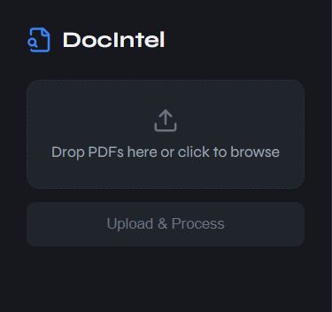
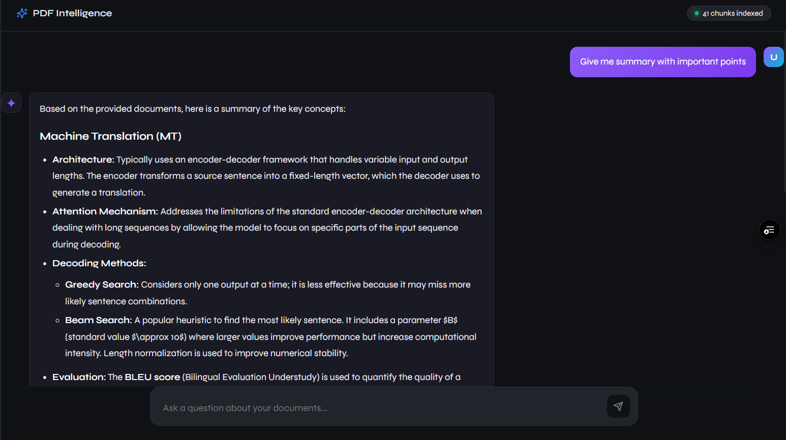
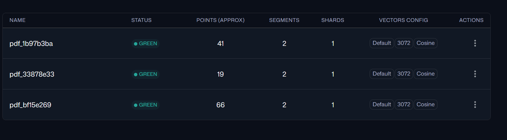
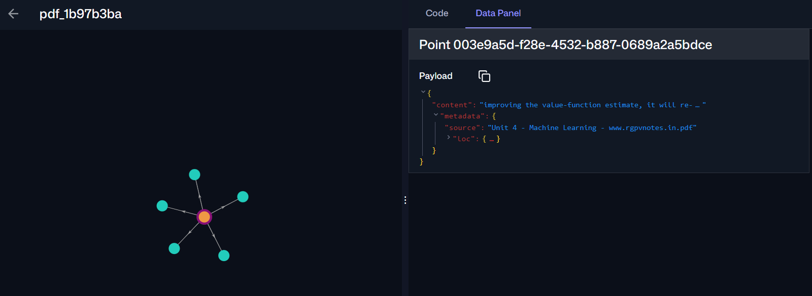

# 🤖 DocIntel – Multi-PDF RAG Chatbot

A production-ready Retrieval-Augmented Generation (RAG) application that allows users to upload multiple PDF documents and interact with them through a conversational AI interface.

Built using React, Node.js, LangChain, Gemini models, and vector search, DocIntel enables accurate document-grounded question answering while minimizing hallucinations through contextual retrieval.

## ✨ Features

- 📄 Upload and process multiple PDFs simultaneously
- 🔍 Semantic document search using vector embeddings
- 💬 Conversational AI chat interface
- 🧠 Context-aware answers generated from uploaded documents
- 📚 Source-aware retrieval for improved response accuracy
- ⚡ Fast document indexing and retrieval pipeline
- 🐳 Fully containerized with Docker & Docker Compose
- 🔒 Secure document processing and isolated storage

## 🛠 Tech Stack

### Frontend

- React.js (Vite)
- Tailwind CSS
- Axios

### Backend

- Node.js
- Express.js
- LangChain
- Gemini
- Multer

### Vector Database

- Qdrant

### Infrastructure

- Docker
- Docker Compose

## 🚀 Key Learning Outcomes

This project demonstrates:

- Retrieval-Augmented Generation (RAG)
- Vector Embeddings
- Semantic Search
- Document Processing Pipelines
- Full-Stack Development
- Docker Containerization
- AI Application Development

## 🏗️ Architecture

```text
┌─────────────────────┐
│ 📄 User Upload PDFs │
└──────────┬──────────┘
           │
           ▼
┌──────────────────────────┐
│ ✂️ PDF Parsing & Chunking│
└──────────┬───────────────┘
           │
           ▼
┌─────────────────────────┐
│ 🧠 Embedding Generation │
└──────────┬──────────────┘
           │
           ▼
┌─────────────────────────┐
│ 🗄️ Qdrant Vector Store  │
└──────────┬──────────────┘
           │
           ▼
┌─────────────────────────┐
│ 🔍 Semantic Retrieval   │
└──────────┬──────────────┘
           │
           ▼
┌─────────────────────────┐
│ 🤖 LLM Answer Generation│
└──────────┬──────────────┘
           │
           ▼
┌─────────────────────────┐
│ 💬 Response to User     │
└─────────────────────────┘
```

## 📷 Screenshots

### Upload Dashboard



_Upload and manage multiple PDF documents._

### AI Chat Interface


Ask questions and receive context-aware responses based on uploaded documents.

### 🗄️ Vector Database Collections



_Document chunks are converted into vector embeddings and stored in Qdrant collections, enabling efficient semantic search and context retrieval for accurate RAG-based responses._

## 🧠 Embedding Generation Pipeline



_Each PDF chunk is converted into a vector embedding and stored in the vector database. When a user asks a question, the query is embedded into the same vector space, enabling semantic similarity search to identify and retrieve the most relevant document context._

## 📂 Project Structure

```text
pdf-intelligence-mern/
├── backend/
│   ├── node_modules/
│   ├── uploads/
│   ├── .env
│   ├── .env.example
│   ├── .gitignore
│   ├── Dockerfile
│   ├── package.json
│   ├── package-lock.json
│   └── server.js
│
├── frontend/
│   ├── node_modules/
│   ├── src/
│   │   ├── api/
│   │   │   └── index.js
│   │   │
│   │   ├── components/
│   │   │   ├── Message.jsx
│   │   │   └── Sidebar.jsx
│   │   │
│   │   ├── App.jsx
│   │   ├── index.css
│   │   └── main.jsx
│   │
│   ├── .env
│   ├── .env.example
│   ├── .gitignore
│   ├── Dockerfile
│   ├── index.html
│   ├── package.json
│   ├── package-lock.json
│   └── vite.config.js
│
└── docker-compose.yml
```

### Structure Overview

- **backend/** – Express.js server, PDF processing, embeddings generation, vector storage, and RAG pipeline.
- **uploads/** – Stores uploaded PDF documents before processing.
- **frontend/** – React application providing the chat interface and document upload dashboard.
- **api/** – Axios API configuration and backend communication.
- **components/** – Reusable UI components such as chat messages and sidebar.
- **Dockerfile** – Container configuration for frontend and backend services.
- **docker-compose.yml** – Orchestrates the complete multi-container application.

```

```

## ⚙️ Setup

```bash
git clone https://github.com/aditya-singhofficial/multi-pdf-rag-chatbot-docintel.git

cd multi-pdf-rag-chatbot-docintel

docker-compose up --build
```

Frontend: http://localhost:5173

Backend: http://localhost:3000

## 🤝 Contributing

Contributions, issues, and feature requests are welcome.

Feel free to fork the repository and submit a pull request.
