# DocIntel — Multi-PDF RAG Chatbot

A production-ready Retrieval-Augmented Generation (RAG) application for intelligent document interaction. Upload multiple PDFs and ask questions — DocIntel retrieves the most relevant context and generates accurate, grounded answers using semantic search and a Gemini LLM.

---

## Features

- Upload and process multiple PDFs simultaneously
- Semantic search via vector embeddings stored in Qdrant
- Conversational chat interface with context-aware responses
- Source-grounded answers that minimize hallucinations
- Fast document indexing and retrieval pipeline
- Fully containerized with Docker and Docker Compose

---

## Tech Stack

| Layer           | Technology                             |
| --------------- | -------------------------------------- |
| Frontend        | React (Vite), Tailwind CSS, Axios      |
| Backend         | Node.js, Express.js, LangChain, Multer |
| LLM             | Google Gemini                          |
| Vector Database | Qdrant                                 |
| Infrastructure  | Docker, Docker Compose                 |

---

### Architecture Diagram



## Architecture

```
PDF Upload
    │
    ▼
PDF Parsing & Chunking        ← text extracted, split into overlapping chunks
    │
    ▼
Embedding Generation          ← each chunk converted to a vector via Gemini Embeddings
    │
    ▼
Qdrant Vector Store           ← vectors stored in a named collection per session
    │
    ▼
User Query → Query Embedding  ← the question is embedded in the same vector space
    │
    ▼
Semantic Retrieval            ← top-k most similar chunks retrieved
    │
    ▼
LLM Answer Generation         ← retrieved context + query sent to Gemini
    │
    ▼
Response to User
```

### How RAG works here

When a PDF is uploaded, the backend parses and splits it into overlapping text chunks. Each chunk is converted into a vector embedding and stored in Qdrant. At query time, the user's question is embedded into the same vector space — the system finds the most semantically similar chunks and passes them as context to Gemini, which generates a grounded answer. This architecture keeps the LLM anchored to the source material rather than relying on training-time knowledge.

---

## Project Structure

```
pdf-intelligence-mern/
├── backend/
│   ├── uploads/          # Temporary storage for uploaded PDFs
│   ├── server.js         # Express server, RAG pipeline, LangChain integration
│   ├── Dockerfile
│   └── .env.example
│
├── frontend/
│   ├── src/
│   │   ├── api/          # Axios client and endpoint configuration
│   │   ├── components/
│   │   │   ├── Message.jsx   # Chat message rendering
│   │   │   └── Sidebar.jsx   # Document upload and management panel
│   │   ├── App.jsx
│   │   └── main.jsx
│   ├── Dockerfile
│   └── .env.example
│
└── docker-compose.yml    # Orchestrates backend, frontend, and Qdrant services
```

---

## Getting Started

### Prerequisites

- [Docker](https://docs.docker.com/get-docker/) and Docker Compose installed
- A [Google Gemini API key](https://aistudio.google.com/app/apikey)

### Setup

```bash
# 1. Clone the repository
git clone https://github.com/aditya-singhofficial/multi-pdf-rag-chatbot-docintel.git
cd multi-pdf-rag-chatbot-docintel

# 2. Configure environment variables
cp backend/.env.example backend/.env
# Add your GEMINI_API_KEY to backend/.env

# 3. Start all services
docker-compose up --build
```

| Service     | URL                             |
| ----------- | ------------------------------- |
| Frontend    | http://localhost:5173           |
| Backend API | http://localhost:3000           |
| Qdrant UI   | http://localhost:6333/dashboard |

---

## Environment Variables

**`backend/.env`**

```env
GEMINI_API_KEY=your_api_key_here
QDRANT_URL=http://qdrant:6333
PORT=3000
```

**`frontend/.env`**

```env
VITE_API_URL=http://localhost:3000
```

---

## Key Concepts Demonstrated

- **Retrieval-Augmented Generation (RAG)** — grounding LLM responses in uploaded source documents
- **Vector Embeddings** — dense numerical representations of text that encode semantic meaning
- **Semantic Search** — similarity-based retrieval that goes beyond keyword matching
- **Document Processing Pipelines** — parsing, chunking, and indexing PDFs at upload time
- **Docker Containerization** — multi-service orchestration with isolated environments

---

## Screenshots

### Upload Dashboard


### Chat Interface


### Qdrant Vector Collections


### Embedding


---

## Contributing

Contributions, issues, and feature requests are welcome. Fork the repository and open a pull request.
